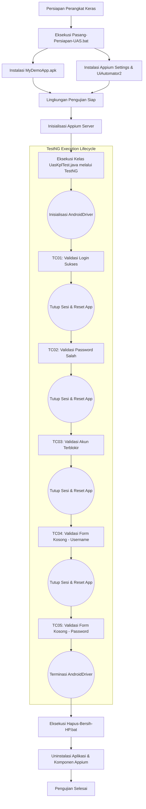

# Laporan Pengujian Otomatis Perangkat Lunak Mobile

---

## Identitas Mahasiswa
- **Nama:** Muhammad Aidil Fitrah
- **NIM:** 2308107010035
- **Mata Kuliah:** Kualitas Perangkat Lunak
- **Tugas:** Ujian Akhir Semester - Mobile Automation Testing

---

## Deskripsi Proyek
Proyek ini mengimplementasikan pengujian otomatis secara *End-to-End* (E2E) pada aplikasi *mobile* berbasis Android. Pengujian dilakukan pada perangkat keras fisik (bukan *emulator*) untuk memastikan perangkat lunak berfungsi dengan semestinya pada lingkungan operasional yang nyata. 

Aplikasi yang digunakan sebagai objek penelitian adalah **Sauce Labs My Demo App**, sebuah aplikasi purwarupa *e-commerce* bersumber terbuka (*open-source*) yang dikembangkan menggunakan framework *React Native*. Fokus utama pengujian ini adalah pada modul **Sistem Autentikasi (Login)**, yang dievaluasi kemampuannya dalam menangani berbagai skenario masukan pengguna, mulai dari pengisian kredensial yang valid hingga penanganan *error* pada pengisian form yang tidak sesuai (*negative test cases*).

---

## Lingkungan Pengujian dan Teknologi
Pengujian ini dibangun menggunakan beberapa instrumen perangkat lunak dan arsitektur pengujian sebagai berikut:
- **Bahasa Pemrograman:** Java (JDK 11 atau versi lebih baru)
- **Framework Pengujian:** TestNG (digunakan untuk struktur asersi dan manajemen *test lifecycle*)
- **Mobile Automation Driver:** Appium (Server) beserta UiAutomator2 (Android Driver)
- **Manajemen Dependensi:** Apache Maven
- **Perangkat Eksekusi:** Perangkat Android Fisik (terhubung melalui *Android Debug Bridge* / ADB)

---

## Alur Kerja Pengujian (Flowchart)
Diagram berikut merepresentasikan alur sistematis dari persiapan perangkat hingga tahap eksekusi pengujian selesai:



---

## Rincian Skenario Pengujian (Test Cases)
Proses pengujian mencakup 5 skenario yang diimplementasikan pada metode-metode dalam kelas `UasKplTest.java`. Setiap pengujian dieksekusi dalam keadaan *stateless* (aplikasi di-reset pada setiap awal metode uji) untuk mencegah interferensi data antar pengujian.

### 1. `TC01_LoginSuccess`
- **Objektif:** Memverifikasi bahwa sistem mengizinkan akses masuk ketika pengguna memberikan kombinasi *username* dan *password* yang terdaftar secara valid.
- **Langkah-langkah:** Membuka menu navigasi lateral -> Memilih opsi *Log In* -> Mengisi *username* `bob@example.com` -> Mengisi *password* `10203040` -> Menekan tombol *Login*.
- **Ekspektasi Hasil:** Pengguna berhasil diautentikasi dan secara otomatis dialihkan ke halaman utama produk (*Products*).

### 2. `TC02_LoginFailed_WrongPassword`
- **Objektif:** Memverifikasi mekanisme keamanan sistem dalam menolak percobaan *login* yang menggunakan kata sandi yang salah.
- **Langkah-langkah:** Membuka form *Log In* -> Mengisi *username* `bob@example.com` -> Mengisi *password* invalid `passwordsalah123` -> Menekan tombol *Login*.
- **Ekspektasi Hasil:** Sistem mencegah proses masuk dan menampilkan pesan kesalahan (*error message*) secara presisi dengan teks *"Provided credentials do not match any user in this service."*

### 3. `TC03_LoginFailed_LockedOut`
- **Objektif:** Memverifikasi penanganan sistem terhadap entitas akun pengguna yang statusnya telah diblokir (*locked out*).
- **Langkah-langkah:** Membuka form *Log In* -> Mengisi *username* terkunci `alice@example.com` -> Mengisi *password* `10203040` -> Menekan tombol *Login*.
- **Ekspektasi Hasil:** Sistem mendeteksi status pemblokiran akun dan memunculkan pesan peringatan *"Sorry, this user has been locked out."*

### 4. `TC04_LoginFailed_NoUsername`
- **Objektif:** Memverifikasi keberadaan dan fungsionalitas validasi *required field* pada kolom isian *username*.
- **Langkah-langkah:** Membuka form *Log In* -> Mengosongkan kolom *username* -> Mengisi *password* `10203040` -> Menekan tombol *Login*.
- **Ekspektasi Hasil:** Transmisi form dibatalkan secara sepihak oleh sistem, dan antarmuka memunculkan pesan validasi *"Username is required"*.

### 5. `TC05_LoginFailed_NoPassword`
- **Objektif:** Memverifikasi keberadaan dan fungsionalitas validasi *required field* pada kolom isian *password*.
- **Langkah-langkah:** Membuka form *Log In* -> Mengisi *username* `bob@example.com` -> Mengosongkan kolom *password* -> Menekan tombol *Login*.
- **Ekspektasi Hasil:** Transmisi form dibatalkan, dan antarmuka memunculkan pesan validasi *"Password is required"*.

---

## Panduan Konfigurasi Lingkungan (Setup Guide)
Bagian ini mendokumentasikan tata cara penyiapan lingkungan pengujian pada sistem operasi Windows dan perangkat Android fisik.

### 1. Syarat Prasyarat (Prerequisites)
1. **Java Development Kit (JDK):** Versi 11 atau lebih baru harus telah terpasang dan dikonfigurasi pada variabel lingkungan `JAVA_HOME`.
2. **Apache Maven:** Telah terpasang untuk keperluan resolusi dependensi (*dependency management*).
3. **Node.js & Appium:** Menjalankan perintah `npm install -g appium` untuk menginstal Appium secara global, dilanjutkan dengan instalasi *driver* via `appium driver install uiautomator2`.

### 2. Konfigurasi Perangkat Keras
Beberapa manufaktur perangkat Android (seperti Xiaomi, Oppo, dan Vivo) menerapkan kebijakan pembatasan *side-loading* otomatis yang menghalangi arsitektur standar Appium untuk menanamkan paket peladen secara nirkabel/terotomasi. Oleh karena itu, disediakan *batch script* khusus sebagai solusi administratif (*workaround*) instalasi:

1. Hubungkan perangkat Android ke PC menggunakan antarmuka kabel USB.
2. Akses menu pengaturan perangkat, dan navigasikan ke opsi **Developer Options** (Opsi Pengembang).
3. Aktifkan fitur **USB Debugging** dan **Install via USB** (jika tersedia dalam menu pengaturan OEM).
4. Buka terminal pada direktori akar (*root*) proyek ini.
5. Jalankan *script* persiapan (*Setup Script*) dengan mengeksekusi perintah operasional:
   ```cmd
   .\Pasang-Persiapan-UAS.bat
   ```
6. *Script* tersebut akan melakukan proses *deployment* manual untuk berkas APK aplikasi *My Demo App* serta komponen UiAutomator2 Server ke dalam sistem memori perangkat.

---

## Panduan Eksekusi Uji Coba (Execution Guide)
Setelah seluruh lingkungan telah divalidasi, proses pengujian otomatis dapat dijalankan melalui serangkaian tahapan berikut:

1. Buka sesi terminal mandiri untuk menjalankan servis utama Appium dengan mengetik:
   ```cmd
   appium
   ```
   *(Pastikan terminal memunculkan informasi balikan bahwa listener REST API Appium telah berjalan aktif).*
2. Pada terminal baru yang berlokasi tepat di dalam direktori proyek, jalankan serangkaian pengujian terotomatisasi menggunakan perintah utilitas Maven:
   ```cmd
   mvn clean test
   ```
   *(Sebagai metode alternatif, kompilasi dan eksekusi dapat dilakukan secara spesifik pada file `UasKplTest.java` dengan memanfaatkan fitur antarmuka grafis Test Runner bawaan pada Integrated Development Environment seperti VS Code atau IntelliJ).*
3. Proses otomasi akan mengambil alih instrumen kontrol layar pada perangkat fisik, mengeksekusi asersi, dan memvalidasi *state* aplikasi pasca-interaksi pada setiap *Test Case*. Log metrik dan rekam jejak keberhasilan pengujian dapat diobservasi secara langsung melalui keluaran terminal eksekusi.

---

## Panduan Terminasi dan Pembersihan Lingkungan (Cleanup Guide)
Sebagai bagian dari *best practice* dalam manajemen siklus hidup pengujian (*testing lifecycle management*), pasca pengujian, perangkat keras harus dikembalikan ke dalam status aslinya. Hal ini esensial untuk membebaskan ruang memori perangkat dan meminimalisir kemungkinan interferensi layanan yang berjalan di latar belakang (*background processes*).

1. Pastikan seluruh siklus pengujian telah diverifikasi selesai.
2. Lakukan inisialisasi *script* pembersihan pada jendela terminal:
   ```cmd
   .\Hapus-Bersih-HP.bat
   ```
3. *Script* pembersih ini dirancang untuk memicu perintah terminasi paket (`adb uninstall`) secara linear terhadap subjek aplikasi eksperimen dan seluruh paket peladen *Appium*. Setelah proses terminasi dieksekusi dengan baik, interkoneksi USB perangkat Android dapat diputus secara aman.
